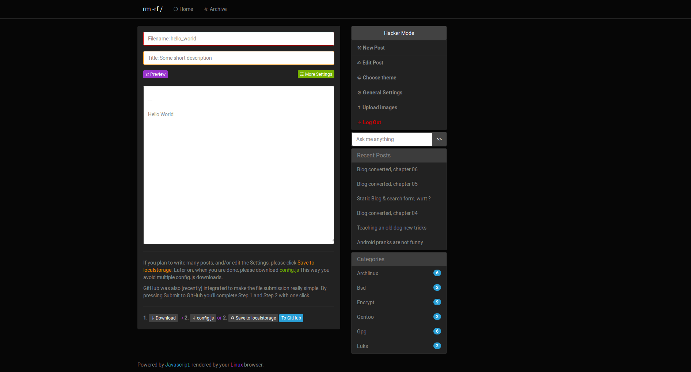
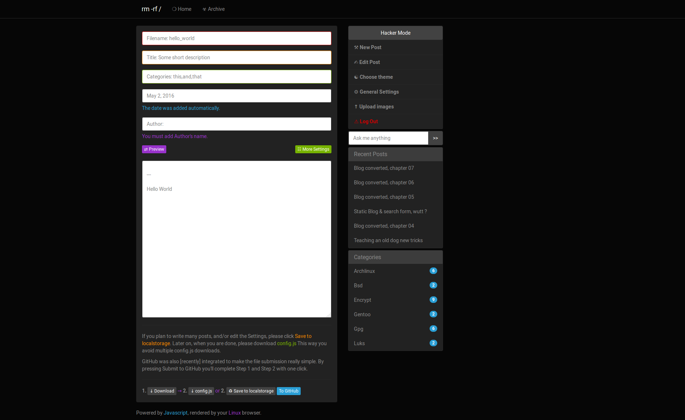
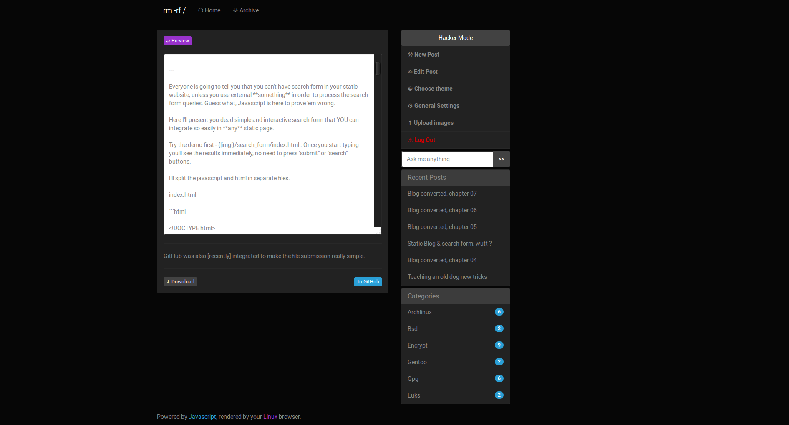
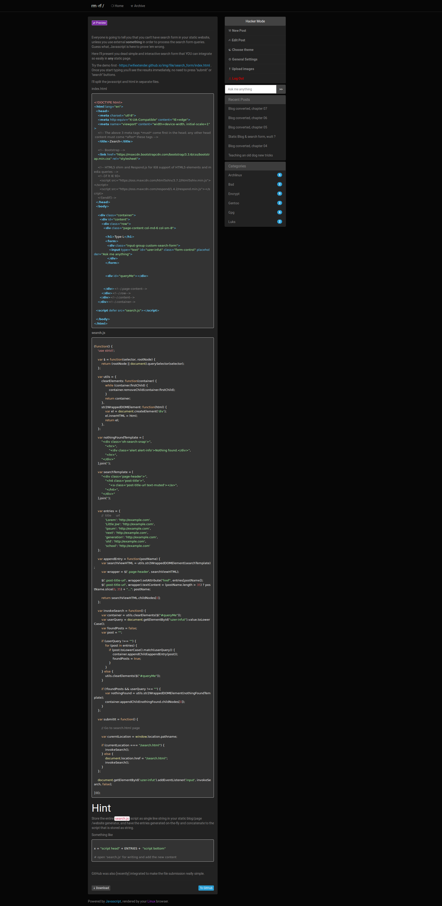
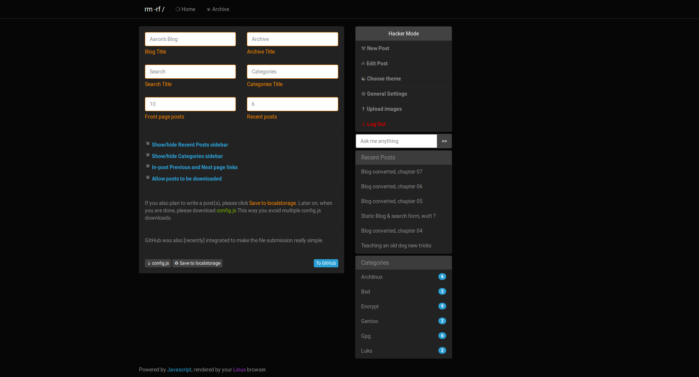
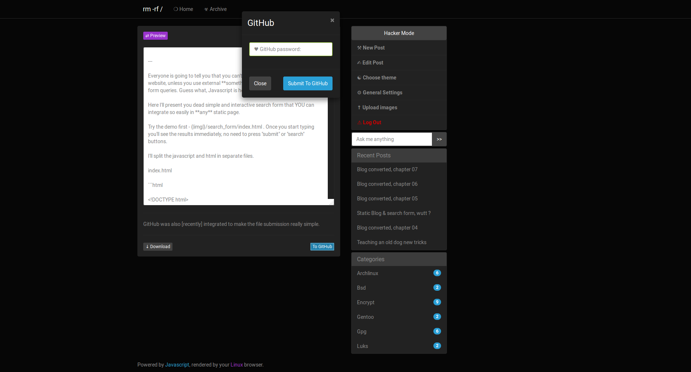
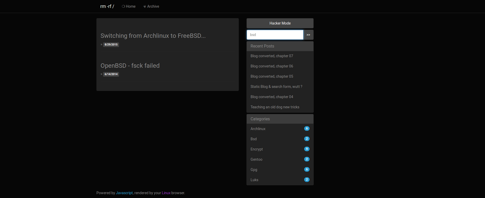
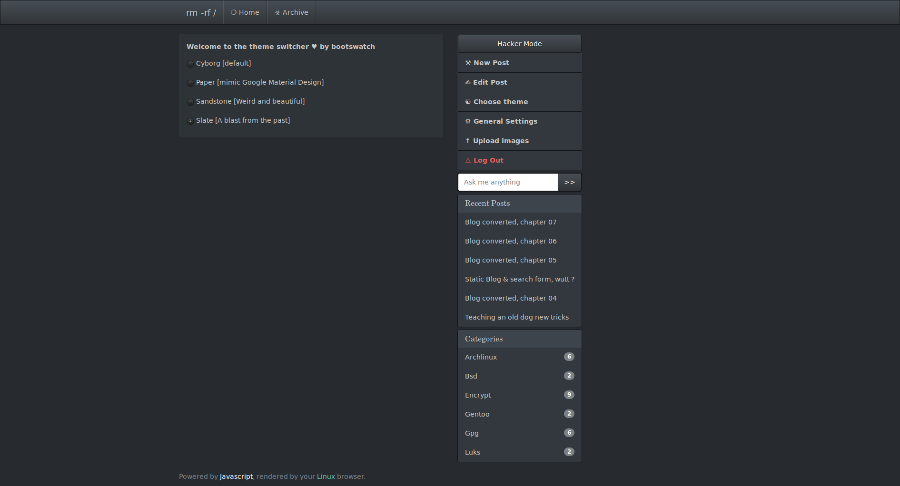

Post writing

More settings clicked

Editing post

Preview button clicked.

The settings section

GitHub modal dialogue to update/create/submit files to your repo.

Progress bar shows the current state while the data is sent to GitHub

Using the search form

The theme section in action

